This is the open source repository for Branch's main documentation portal. You can find the live version at https://dev.branch.io. Staging is at http://dev.staging.branch.io.s3-website-us-west-1.amazonaws.com

# Installation

If you're interested in building the documentation portal on your local machine, follow the steps below.

> #### Prerequisites
> - [Node.js](https://nodejs.org/en/)
> - [Ruby](http://www.ruby-lang.org/en/downloads/) and [RubyGems](https://rubygems.org/)
> - Linux, Unix, or Mac OS X
> - Xcode command line tools (run `xcode-select --install`)
> - [Bundler](http://bundler.io) (run `gem install bundler`)

### 1. Clone repo
In your shell, navigate to the location you want to store the documentation site. Next run:

```
git clone https://github.com/BranchMetrics/documentation.git
```

### 2. Install Jekyll and Dependencies
Install all the required Node.js and Ruby packages:

```
npm install && bundle install
```

# Running the project

To generate the static site files and serve them, open a new shell window, navigate the the `documentation` folder in the cloned repo, and run:

```
bundle exec jekyll serve
```

Wait for the build process to finish, and then open [http://localhost:4000](http://localhost:4000) in your web browser.

## Troubleshooting

### Connection errors with Jekyll builds

```
Conversion error: Jekyll::BrowserifyConverter encountered an error while converting 'js/all.js':
                    Connection refused - connect(2) for "localhost" port 20219
```

If you get connection errors like the above from Jekyll, try increasing your open file limit. Then rerun Jekyll (it may take a couple of attempts):

```
ulimit -n 10000; bundle exec jekyll serve;
```

Wait for the build process to finish, and then open [http://localhost:4000](http://localhost:4000) in your web browser.

You'll need to do this every time you open a new shell window.

### Permissions errors

If you run into trouble with either `bundle` or `npm` commands, you may need to use `sudo`. Of course, as always:

> We trust you have received the usual lecture from the local System Administrator.
> It usually boils down to these three things:
>
> 1. Respect the privacy of others.
> 2. Think before you type.
> 3. With great power comes great responsibility.

### Using the --trace option

The output of Jekyll's `--trace` option can often be useful for debugging build problems:

```
bundle exec jekyll serve --trace
```

## Useful tools

### Testing for broken links

To check for broken links in the generated site, run:

```
htmlproof --href-ignore /^$/ ./_site/
```

### Building local search index

Search will not work locally until you create an index for it. First, generate the static site with:

```
bundle exec jekyll serve
```

When the build process has completed, and while the site is being served, run:

```
npm run build_search
```

# Guidelines for writing

This is the documentation for the docs. It describes how the site works, what is supported, and best practices to make collaboration easier.

For a sample file with the most common elements preloaded, see `features/template.md` (preview available [here](https://dev.branch.io/features/template/)).

## Editing procedure

It is recommended to make changes on a new branch, and then submit a pull request to `master`. Ask for someone to thumb it up before merging.

***Important:*** `master` *is the production branch! If you push changes there, they will be deployed to [https://dev.branch.io](https://dev.branch.io)!*

We also have a staging server. Any changes pushed to the `staging` branch will deploy to [http://dev.staging.branch.io.s3-website-us-west-1.amazonaws.com](http://dev.staging.branch.io.s3-website-us-west-1.amazonaws.com)

## Content organization

Even though the front-end generated URL structure and back-end file system are technically independent, keeping them synchronized makes life easier.

### The sidebar

To configure the navigation sidebar, edit the `_data/sidebar.yml` file.

### Pages

All main content files are kept inside the `pages` directory. Generally:

| Directory | URL
| --- | ---
| pages/basic-setup | https://dev.branch.io/basic-setup/...
| pages/cross-channel-analytics | https://dev.branch.io/cross-challen-analytics/...

***Note:*** *second level directories (e.g. Marketing Channels* > **Web to App** > *Deepviews) in the sidebar and breadcrumbs are not reflected in the URL or file system)*

### Ingredients

Small snippets of often reused and/or frequently updated content, kept within the `ingredients` directory. To make a good ingredient, the content should be relatively self-contained.

### Images

Example images used directly in content pages are kept in the `img/pages` directory, filed into folders by section and page name to match the `pages` directory.

Example images used in ingredients are kept in the `img/ingredients` directory, filed into folders ingredient name to match the `ingredients` directory.

***Note:*** *if an image is reused in multiple places, please create multiple copies to avoid cross-linking!*

## Page sections

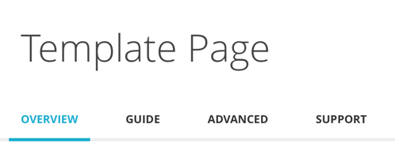

Each documentation page can have up to four distinct sections. All are optional depending on the needs of each page, and **Guide** should be used for pages with only one section.

### Overview

What this feature does and why you might want it, like the dust jacket blurb on a book.

| Component | Details
| --- | ---
| **Platforms** | Not supported
| **Table of contents** | Not supported
| **Alternating content rows** | Not supported

### Guide

Simple, step-by-step instructions to implement this feature.

| Component | Details
| --- | ---
| **Platforms** | Yes
| **Table of contents** | Yes, numbered (override available)
| **Alternating content rows** | Yes, numbered (override available)

### Advanced

Anything about this feature outside of the minimum steps to get up and running.

| Component | Details
| --- | ---
| **Platforms** | Yes
| **Table of contents** | Yes, unnumbered
| **Alternating content rows** | Yes, unnumbered

### Support

Selected troubleshooting/FAQ issues.

| Component | Details
| --- | ---
| **Platforms** | Yes
| **Table of contents** | Yes, unnumbered
| **Alternating content rows** | Yes, unnumbered

## Formatting

All standard markdown is supported.

***Note:*** *it is preferred to specify code blocks and images using the `highlight` and `image` liquid tags (below).*

### Structural headers

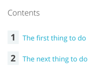

Level two headers are special:

- The highest level of header used in the docs (level one headers should be avoided).
- Generate the Table of Contents at the top of each page section.
- Demarcate alternating rows of content.

Either method works for indicating headers:

```
## The first thing to do

The next thing to do
----
```
## Liquid tags
There are a number of liquid tags available to structure content. All follow standard Jekyll syntax and must be terminated: ` Content here `

### pro tip

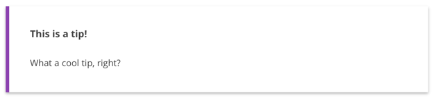

Creates a block element used for things the user might like to know.

| Attribute | Usage
| ---: | ---
| **title** | Show a title at the top of the block. Will be hidden if left blank.

```

What a cool tip, right?

```

### caution

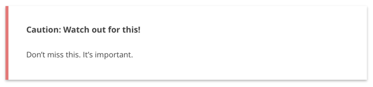

Creates a block element used for things the user shouldn't miss (otherwise bad stuff will happen).

| Attribute | Usage
| ---: | ---
| **title** | Show a title at the top of the block, appended to "**Caution:**". Will default to **"Caution"** if left blank.

```

Don't miss this. It's important.

```

### example

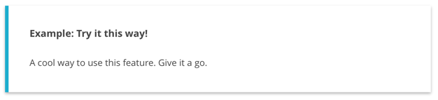

Creates a block element used for:

- Ready-to-go implementations of something that was explained in abstract but isn’t required for basic implementation.
- Real-world usage of something that is required for basic implementation but has multiple permutations depending on user’s situation.

| Attribute | Usage
| ---: | ---
| **title** | Show a title at the top of the block, appended to "**Example:**". Will default to **"Example"** if left blank.

```

A cool way to use this feature. Give it a go.

```

### prerequisite

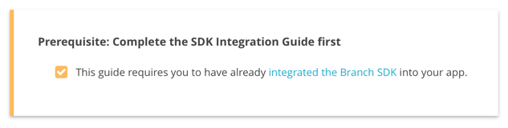

Creates a block element used to indicate if something else must be done in advance.

| Attribute | Usage
| ---: | ---
| **title** | Show a title at the top of the block, appended to "**Prerequisite:**". Will default to **"Prerequisites"** if left blank.

```


- This guide requires you to have already [integrated the Branch SDK]({{base.url}}/getting-started/sdk-integration-guide) into your app.


```

### if
Conditionally display wrapped content only for the specified section or platform.

| Attribute | Usage
| ---: | ---
| **page.[section]** | `overview`, `guide`, `advanced`, `support`
| **page.[platform]** | `ios`, `android`, `cordova`, `xamarin`, `unity`, `adobe`, `titanium`, `react`, `web`

- These statements can be nested, except within the `page.overview` section which does not support platform conditionals.
- **elsif** is available
- To prevent insanity, we try to keep `page.[section]` content contiguous, even though this is not technically necessary.

```


Overview content goes here, but platform conditionals will be ignored in this section.



Platform conditionals ARE available for nesting here.


Content for iOS only!


Content for Android only!



```

### highlight

The recommended way to input fenced code blocks.

| Attribute | Usage
| ---: | ---
| **[language]** | [Everything you could ever want](http://pygments.org/docs/lexers/). You must specify a language or things will break.

```

branch.link({
    channel: 'sms',
    feature: 'share',
    data: {
    "$ios_deepview": "default_template",
    "$android_deepview": "default_template"
    }
}, function(err, link) {
  if (!err) {
      console.log("Ready to share my " + link);
  }
});

```

### raw

If you want to print certain characters that Jekyll would typically attempt to parse, use this tag to pass through the literal values.

```
{{app}}
```

### image

Use this tag to insert an image file.

| Attribute | Usage
| ---: | ---
| **[width]** | `full`, `3-quarters`, `2-thirds`, `half`, `third`, `quarter`, `actual`. **Default: `full`**
| **[position]** | `nofloat`, `right`, `left`, `center`. **Default: `nofloat`**
| **src** | URL for the image file
| **alt** | Alt text for the image

```

```

### ingredient

Import an ingredient by name from the `ingredients` directory.

| Attribute | Usage
| ---: | ---
| [name] | The path/to/filename (omitting `.md`) of the ingredient to import

```

```

### section

Use to wrap content within an ingredient file, demarcating it as something that can be overridden when calling that ingredient.

| Attribute | Usage
| ---: | ---
| [name] | A name for the section you are defining

```
## Best Title Ever
```

### override

Use to wrap content that will override a defined section in an ingredient you are calling.

| Attribute | Usage
| ---: | ---
| [name] | The name of the section you are overriding

```
## Even Better Title!
```

### tabs/tab

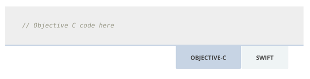

Define a set of switchable tabs, most commonly used to show both Objective-C and Swift examples for iOS.

| Attribute | Usage
| ---: | ---
| [name] | The name of the tab. Must not contain spaces.

```




// Objective C code here






// Swift code here




```

### getstarted

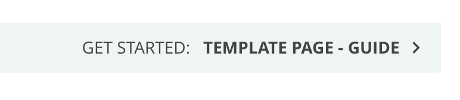
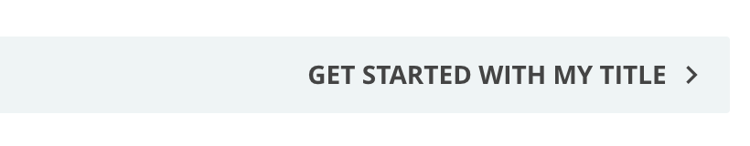
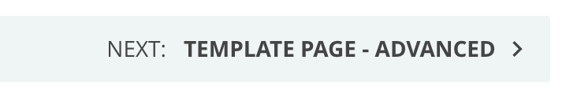
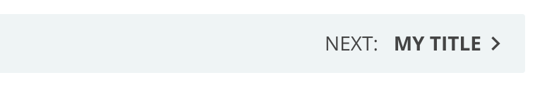

Used at the bottom of the Overview page section. Creates a button to the next section. Also customizable to create next buttons to next sections, or to custom sections with custom titles.

| Attribute | Usage
| ---: | ---
| **title** | Specify the text of the button. Will default to "Get Started:** Page Title - Section**" if left blank.
| **next** | Set to true to change "Get Started" to "Next". Button text is "Next:** Page Title - Section**".
| **next**, **title** | Specify the text of the next button as well as a page to link to.

```







```

### premiumflag

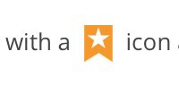

Inserts an inline icon to indicate a feature or option is premium-only.

```

```

## Jekyll front matter
This YAML block appears at the top of every main content page:

```
---
type: recipe
directory: features
title: "Template Page"
page_title: "A template for Branch documentation pages"
description: Use this file as a template when creating new pages for the Branch documentation portal.
keywords: Branch, Template, Documentation, Docs, Documentation Template,
platforms:
- ios
- android
- cordova
- xamarin
- unity
- adobe
- titanium
- react
sections:
- overview
- guide
- advanced
- support
- custom-1
- custom-2
hide_platform_selector:
- advanced
- custom-2
contents:
  list:
  number:
    - advanced
  hide:
    - custom-2
---
```

| Parameter | Usage |
| ---: | --- |
| **type** | The page type. The only currently option in use is `recipe`
| **directory** | The pretty URL directory for this page in the rendered site. Options: `features`, `third-party-integrations`, `getting-started`, `methods-endpoints`
| **title** | Page name used in the navigation sidebar, in breadcrumbs, and at the top of the content area.
| **page_title** | Longer page name used in the browser title bar. Can also be specified by platform using **ios_page_title** and **android_page_title** instead.
| **description** | Short description of page content, used in search results and section landing pages. Can also be specified by platform using **ios_description** and **android_description** instead.
| **keywords** | Comma-separated keywords used for search. Can also be specified by platform using **ios_keywords** and **android_keywords** instead.
| **platforms** | *(Optional)* Items to show in the platform selector, which appears at the top of every page section except Overview. Available options are `ios`, `android`, `cordova`, `xamarin`, `unity`, `adobe`, `titanium`, `react`, and `web`
| **sections** | Sections used on page. Available options are `overview`, `guide`, `advanced`, `support`, or custom section titles.
| **contents** | *(Optional)* Controls the style of Table of Contents and alternating content rows on the Guide page section. Available options are `list`, `number`, and `hide`. Defaults to `hide` for overview sections, `number` for guide sections, and `list` for everything else. Set specific styles for specific pages like in the example above.
| **hide_section_selector** | *(Optional)* Set `true` to hide the section selector.
| **hide_platform_selector** | *(Optional)* Set `true` to hide the platform selector, or set for specific pages like in the example above.
| **exclude_from_google_search** | *(Optional)* Set `true` to keep Google (and others) from indexing this page.

## Managing search results

To keep a page from showing up in search results:

1. Set `exclude_from_google_search` (above) to `true`, to block external search engines.
1. Add the filename of the page (omitting `.md`) to `js/search/excluded_files.json`, to block the internal search engine.

#### Important Notes
- Exclusion matching is currently imperfect: excluding a filename of `foo` will also exclude `foo-bar`.
- Pages will still be accessible by direct URL, and search engines may not respect the `noindex` setting. All content published should be considered as public.

## Best practices

- Never edit anything inside the `_site` directory. These are all generated files and are **always** overwritten.
- Ask before editing files elsewhere unless you're extremely confident that you know what you're doing.
- Use level two headers (H2) to structure content. For example, major steps in the Guide, or individual topics in Advanced and Support.
- Use numbered lists for smaller steps within the major steps if there are more than one.
- Use level five headers (H5) for FAQ questions. It looks just like bold text, but it helps with SEO.
- In general, use whatever heading level is next in line. If you get past H4, ask yourself probing questions.
- Keep page sections (`overview`, `guide`, `advanced`, `support`) contiguous for sanity, even though the conditional syntax doesn’t require it.
- Deep Link is **always two words**, in every form (noun, verb, adjective)
